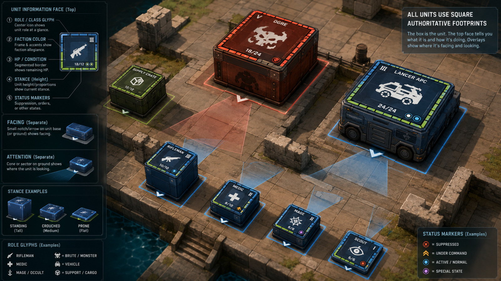

# S.I.R. Visual Direction

## Purpose

This document captures the intended graphical language of S.I.R. It describes
the direction communicated by concept art without treating every depicted label,
symbol, proportion, or interface element as a finalized gameplay rule.

## Primary concept

**Source:** Concept art supplied by the project owner on 2026-07-25.

## Established direction

The concept presents the battlefield as a readable, isometric tactical space
with a grounded near-future aesthetic. Units are represented as physical square
or rectangular prisms whose bases correspond directly to their authoritative
grid footprints. The unit representation is therefore simultaneously a game
piece, a spatial occupancy indicator, and an information surface.

The box-shaped unit body is the intended final visual abstraction. It is not a
placeholder for a conventional animated character or vehicle model. Different
unit categories can vary in footprint, height, proportions, surface treatment,
and information design while remaining within this shared box-based language.

The top face of a unit communicates important identity and state at a glance.
At normal gameplay zoom, the unit's identification glyph and current hit points
must remain readable. The concept demonstrates a wider visual hierarchy that
can include:

- role or class glyph;
- faction color and frame;
- unit name or type;
- hit points or condition;
- stance through the height and proportions of the piece; and
- compact status markers.

Whether these additional elements must remain visible or readable at normal
zoom will be determined through visual prototypes and playtesting.

Facing and attention are separate concepts. Facing is shown with a small
directional indicator close to the base, while attention or observation is
visualized as a cone or sector projected onto the ground.

## Battlefield presentation

The environment uses a three-dimensional isometric presentation with a visible
square grid integrated into the terrain. Architecture and props remain
recognizable and materially grounded, while unit pieces and tactical overlays
use stronger color, shape, and contrast.

The current concept combines:

- worn stone, masonry, water, barriers, handrails, and modern equipment;
- stylized but materially readable lighting and surfaces;
- strong blue, red, and green faction or ownership accents;
- luminous footprint outlines;
- translucent ground overlays for attention or sensor coverage; and
- compact iconography designed to remain readable at tactical camera distance.

This contrast allows the battlefield to feel like a place while the active
tactical state remains legible.

## Unit-as-interface principle

The unit representation should communicate as much essential information as
possible directly on or immediately around the unit. This reduces dependence on
a detached HUD and makes large-force state easier to scan spatially.

The concept separates information by surface:

| Surface | Intended information |
|---|---|
| Top face | Identity, role, faction, condition, and compact status |
| Body height | Stance or vertical profile |
| Base outline | Authoritative footprint and allegiance |
| Base indicator | Facing |
| Ground overlay | Attention, observation, targeting, or other spatial influence |

This mapping is a design direction, not yet a final UI contract.

## Scale expression

Different entities may use different square footprint sizes while retaining the
same overall graphical language. The concept depicts individual units, support
or cargo objects, a large monster, and a vehicle as related game pieces of
different footprints and heights.

This supports the vision that:

- the base is authoritative for spatial occupation;
- stance can change a unit's visible height without changing its identity;
- large entities remain immediately distinguishable;
- role and state remain readable without inspecting a separate panel; and
- the player can scan a battlefield containing 50–100 units per side.

## Tactical overlays

Overlays should explain transient or selected tactical state without permanently
covering the environment. The concept suggests overlays for:

- unit footprint;
- facing;
- attention or observation sector;
- faction or control;
- suppression;
- command state;
- normal or active state; and
- special state.

These examples establish a visual vocabulary but do not yet establish the final
set of statuses or their exact colors.

Overlay visibility must be customizable by the human player and client. Players
should be able to show or hide distinct tactical information according to their
current task rather than having line of sight, sensors, communications,
electronic warfare, and other fields permanently displayed together.

Hotkeys for quickly toggling individual overlays are a candidate interaction,
but the exact controls, defaults, combinations, and persistence of overlay
preferences require prototyping and testing.

It is not yet decided whether selection or gameplay context may cause relevant
overlays to appear automatically. Both fully explicit control and contextual
display should remain available for evaluation in client prototypes.

## Color and accessibility

Color is a valid standalone category for communicating faction, status, or
tactical information. The visual language does not require every color-coded
distinction to be repeated through a glyph, pattern, label, or other redundant
channel.

Accessibility should instead be supported through customizable color schemes.
The canonical client may provide alternative palettes and user-defined color
configuration, with the exact scope and presets determined through testing.

## Information certainty

The canonical presentation does not currently classify information as certain,
uncertain, stale, or indirectly reported. Information received by the player is
presented as information; deciding how reliable or conclusive it is belongs to
the human player or client.

Future research, intelligence, or data-analysis capabilities may provide
additional information from which a player or client can draw stronger
conclusions. This does not presently require a universal visual certainty
category.

## Lost hostile contact

When a previously observed hostile unit is no longer observable through the
information currently available to the player, the canonical client shows
nothing for that unit. It does not leave a last-known-position marker, ghost,
faded unit, or uncertainty indicator.

## Relationship to gameplay

The graphical approach reinforces several core design goals:

- **Consequential positioning:** footprints, facing, and observation are visible
  spatial facts.
- **Non-omniscient command:** attention and sensor information can be displayed
  only when it is known to the observing player.
- **Automated micro-control:** unit state and intent can be monitored at scale
  without following every action individually.
- **Large forces:** glyphs, silhouettes, colors, and top-face information support
  rapid recognition across many units.
- **Modern fantasy integration:** contemporary military roles, vehicles, supply,
  monsters, and magic share one coherent tactical presentation.

## Provisional elements

The following details appear in the concept but are not yet confirmed as
authoritative design facts:

- the exact role list, including rifleman, medic, mage, scout, and vehicle;
- the precise meaning of displayed numbers and tier markers;
- which information beyond identification glyph and hit points remains readable
  at normal gameplay zoom;
- exact faction colors;
- exact status icon colors and meanings;
- whether crouched and prone stances change only height or also footprint;
- whether attention is always a cone rather than another field shape;
- whether top-face information is always visible;
- the final camera angle, zoom range, and environmental rendering style.

## Questions for later visual design

1. When should tactical overlays appear automatically, on selection, or only on
   request?
